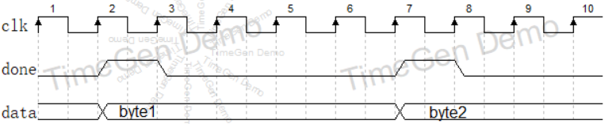
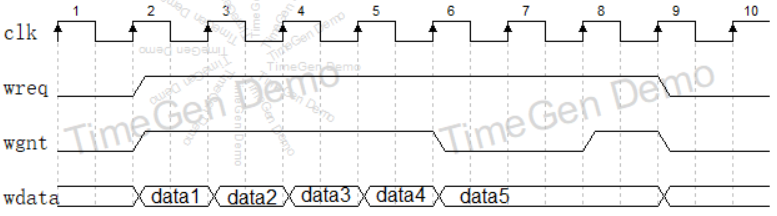
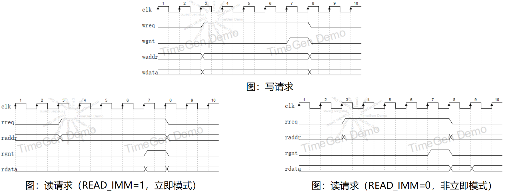

Verilog-UART
===========================
包含4种可独立使用的模块：

* **UART接收器**：[./RTL/uart_rx.sv](./RTL/uart_rx.sv)
* **UART发送器**：[./RTL/uart_tx.sv](./RTL/uart_tx.sv)
* **UART发送器(AXI-stream接口)**：[./RTL/axi_stream_to_uart_tx.sv](./RTL/axi_stream_to_uart_tx.sv)
* **UART交互式调试器**：[./RTL/debug_uart.sv](./RTL/debug_uart.sv)

# UART接收器

UART接收器的源文件是 [./RTL/uart_rx.sv](./RTL/uart_rx.sv) ，接口定义如下：

```SystemVerilog
module uart_rx #(
    parameter CLK_DIV = 108  // UART波特率 = clk频率/(4*CLK_DIV)
                             // 修改 CLK_DIV 可改变 UART 波特率
                             // 例如, 当 clk=125MHz, CLK_DIV=271 时，波特率 =125MHz/(4*271)=115200
) (
    input  logic clk, rst_n, // 时钟和复位，
                             // 请根据clk的实际频率修改 parameter CLK_DIV 以适应实际的波特率
                             // 复位为低电平复位

    input  logic rx,         // UART RX 信号

    output logic done,       // 若某个clk周期，done=1，说明已接收到一个字节，
    output logic [7:0] data  // 若某个clk周期，done=1，则data有效，data即为接收到的字节
);
```

**done和data信号** 的时序图如下，当done=1时，说明模块接收到一个UART数据，data有效（此时可以被捕获），data将会持续保持有效直到下一个done=1来临。



### 示例

uart_rx 的示例在路径 [./Arty-examples/uart_rx](./Arty-examples/uart_rx)，该示例基于 [Arty开发板](http://www.digilent.com.cn/products/product-arty-board-artix-7-fpga-development-board-for-makers-and-hobbyists.html)。当用户使用上位机发送一个字节到开发板时，开发板上的8个LED灯显示出该字节的二进制数。

# UART发送器

UART发送器的源文件是 [./RTL/uart_tx.sv](./RTL/uart_tx.sv) 。UART发送器内部有一个FIFO，缓存暂时未发送的数据。所以，发送数据的方式是向FIFO中写入数据。写FIFO的时序图如下，该时序图中连续向FIFO写入了5个字节，期间wreq置1，代表持续的写入请求，前四个字节时rgnt=1，说明它们在一个周期内就成功写入。第5个字节时rgnt=0，说明FIFO满了（因为UART的发送速度远不如FIFO的写入速度），则wreq和wdata要持续保持直到wgnt=1为止，第5个字节才被成功写入。



另外，UART发送器还支持多种功能： **位宽定制** ， **大小端序控制** ， **HEX模式与ASCII模式** 。详见 [uart_tx.sv](./RTL/uart_tx.sv) 中的注释

### 示例

uart_tx 的示例在路径 [./Arty-examples/uart_tx](./Arty-examples/uart_tx)，该示例基于 [Arty开发板](http://www.digilent.com.cn/products/product-arty-board-artix-7-fpga-development-board-for-makers-and-hobbyists.html)。该示例循环向上位机发送 arty 开发板上按键和开关的信息，拨动按键和开关可以看到发送数据的变化。

# UART发送器(AXI-stream接口)

源文件是 [./RTL/axi_stream_to_uart_tx.sv](./RTL/axi_stream_to_uart_tx.sv) ，该UART发送器接收 AXI-stream 形式的数据，并通过 UART 以十六进制数的形式打印出来。AXI-stream中相邻的数在UART发送时会以空格隔开，AXI-stream的tlast信号会导致UART打印一个\\n。


# UART交互式调试器

UART交互式调试器的源文件是 [./RTL/debug_uart.sv](./RTL/debug_uart.sv)，它能接收上位机的命令，完成总线读写、存储器读写，并将结果反馈给上位机。是调试FPGA存储器或SoC系统的有效工具。

UART交互式调试器 的示例在路径 [./Arty-examples/debug_uart](./Arty-examples/debug_uart)，该示例基于 [Arty开发板](http://www.digilent.com.cn/products/product-arty-board-artix-7-fpga-development-board-for-makers-and-hobbyists.html)。该示例将debug_uart与一个BRAM连在一起，我们可以通过UART命令的方式来读写BRAM。

上传该示例后，在上位机的串口调试助手等软件中：

* 输入 **addr\n** 可以读出 BRAM addr 地址处的数据（以十六进制），例如，输入 **12\n** 能读出 地址 0x12 处的数据。
* 输入 **addr data\n** 可以将 data 写入BRAM地址addr（以十六进制），例如，输入 **12 deadbeef\n** 代表将 0xdeadbeef 写入 地址0x12。

实际上，debug_uart.sv 将 **addr\n** 这样的指令转化成了总线上的读请求；将 **addr data\n** 这样的指令转化成了总线上的写请求。读写请求时序图如下。



* 当用户发送 **addr data\n** 这样的指令时，debug_uart 对外发起一次写请求，将wreq置高，同时给出waddr和wdata，直到响应产生为止（wgnt=1）。
* 当用户发送 **addr\n** 这样的指令时，debug_uart 对外发起一次读请求，将rreq置高，同时给出raddr，直到产生响应为止（rgnt=1）。然后debug_uart捕获 rdata上的数据并反馈给上位机。至于捕获rdata的时机，有两种策略，debug_uart有一个参数叫READ_IMM，当READ_IMM=1时，rdata在rgnt=1时的那一时钟周期被捕获（如上图左）。当READ_IMM=0时，rdata在rgnt=1时的下一个时钟周期被捕获（如上图右）。

> debug_uart 等待读写响应都可以设置超时，超时周期在debug_uart.sv的parameter中设置（详见注释）。当发生超时时，debug_uart结束读写请求，并反馈timeout给上位机。

除了调试BRAM，debug_uart还在笔者的其它项目中被用到：

* [SDRAM-Controller项目](https://github.com/WangXuan95/SDRAM-Controller) 中，用来调试SDRAM的读写
* [USTC-RVSoC项目](https://github.com/WangXuan95/USTC-RVSoC) 中，用来作为SoC总线调试器，完成程序上传、内存查看等功能（有所修改）
