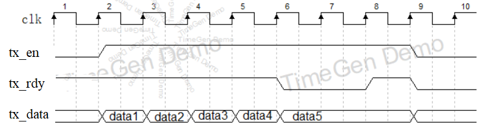
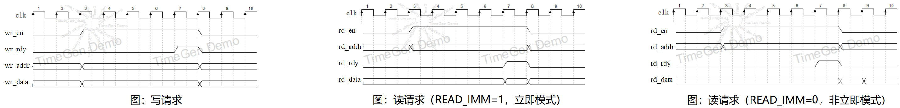

-CAD09D.svg)   

Verilog-UART
===========================
本库包含3种可独立使用的模块：

* **UART接收器**：[RTL/uart_rx.sv](./RTL/uart_rx.sv)
* **UART发送器**：[RTL/uart_tx.sv](./RTL/uart_tx.sv)
* **UART交互式调试器**：[RTL/debug_uart.sv](./RTL/debug_uart.sv)


# UART接收器 uart_rx

UART接收器的代码文件是 [RTL/uart_rx.sv](./RTL/uart_rx.sv) ，定义如下：

```verilog
module uart_rx #(
    parameter CLK_DIV = 434,     // UART baud rate = clk freq/CLK_DIV. for example, when clk=50MHz, CLK_DIV=434, then baud=50MHz/434=115200
    parameter PARITY  = "NONE"   // "NONE", "ODD" or "EVEN"
) (
    input  wire       rstn,
    input  wire       clk,
    // uart rx input signal
    input  wire       i_uart_rx,
    // user interface
    output reg  [7:0] rx_data,
    output reg        rx_en
);
```

其中：

- CLK_DIV 是分频系数，决定了 UART波特率， UART波特率 = clk频率 / CLK_DIV 。
- PARITY 决定了校验位，"NONE"是无校验位，"ODD"是奇校验位，"EVEN"是偶校验位。
- rstn 是复位，在开始时让 rstn=0 来复位，然后让 rstn=1 释放复位。
- clk 是时钟。
- i_uart_rx 是 UART 接收信号。
- **rx_data 和 rx_en 信号**：当 rx_en=1 时，说明模块接收到一个字节的 UART 数据，同时该字节在 rx_data 有效。


# UART发送器 uart_tx

UART发送器的代码文件是 [RTL/uart_tx.sv](./RTL/uart_tx.sv) ，定义如下：

```verilog
module uart_tx #(
    parameter CLK_DIV     = 434,       // UART baud rate = clk freq/CLK_DIV. for example, when clk=50MHz, CLK_DIV=434, then baud=50MHz/434=115200
    parameter PARITY      = "NONE",    // "NONE", "ODD" or "EVEN"
    parameter ASIZE       = 10,        // UART TX buffer size = 2^ASIZE bytes, Set it smaller if your FPGA doesn't have enough BRAM
    parameter DWIDTH      = 1,         // Specify width of tx_data , that is, how many bytes can it input per clock cycle
    parameter ENDIAN      = "LITTLE",  // "LITTLE" or "BIG". when DWIDTH>=2, this parameter determines the byte order of tx_data
    parameter MODE        = "RAW",     // "RAW", "PRINTABLE", "HEX" or "HEXSPACE"
    parameter END_OF_DATA = "",        // Specify a extra send byte after each tx_data. when ="", do not send this extra byte
    parameter END_OF_PACK = ""         // Specify a extra send byte after each tx_data with tx_last=1. when ="", do not send this extra byte
)(
    input  wire                rstn,
    input  wire                clk,
    // user interface
    input  wire [DWIDTH*8-1:0] tx_data,
    input  wire                tx_last,
    input  wire                tx_en,
    output wire                tx_rdy,
    // uart tx output signal
    output reg                 o_uart_tx
);
```

UART发送器内部有一个FIFO，缓存暂时未发送的数据。所以，发送数据的方式是向FIFO中写入数据。写FIFO的波形图如图1，其中 tx_en 和 tx_rdy 构成了握手信号，这张图中它连续向FIFO写入了5个数据，期间 tx_en 置1，代表持续的写入请求，前四个数据时 tx_rdy=1，说明它们在一个周期内就成功写入。第5个数据时 tx_rdy=0，说明FIFO满了，则 tx_en 和 tx_data 要持续保持直到 wgnt=1 为止，第5个数据才被成功写入。

|          |
| :--------------------------------: |
| 图1：向 uart_tx 中发送数据的波形图 |

uart_tx.sv 的其它说明：

- CLK_DIV 是分频系数，决定了 UART波特率， UART波特率 = clk频率 / CLK_DIV 。
- PARITY 决定了校验位，"NONE"是无校验位，"ODD"是奇校验位，"EVEN"是偶校验位。
- DWIDTH 决定了每个数据具有多少个字节，也就是 tx_data 的数据位宽，1代表1字节，2代表2字节...
- ENDIAN 决定了字节序：
  - "LITTLE"是小端序，代表数据中的低字节先发送；
  - "BIG"是大端序，代表数据中的高字节先发送。
- MODE 决定了发送模式：
  - "RAW"是直接发送字节；
  - "PRINTABLE"是只发送ASCII可打印字节，跳过不可打印字节；
  - "HEX"是十六进制打印模式，对于一个字节 0xAB ，它实际上会转化成两个字节 "A", "B" 来发送。
  - "HEXSPACE"是十六进制加空格打印模式，对于一个字节 0xAB ，它实际上会转化成三个字节 "A", "B", " "(空格) 来发送。
- END_OF_DATA 决定了是否在每个数据后额外加一个字节：
  - 如果让 END_OF_DATA="" ，则不发送额外的字节。
  - 可以让 END_OF_DATA="\n" ，这样每次发送完一个数据就发送一个换行。
- END_OF_PACK 决定了是否在每次 tx_last=1 的数据后额外加一个字节。在输入 tx_data 的同时，你可以令 tx_last=1 ，这样：
  - 如果让 END_OF_PACK="" ，则不发送额外的字节。
  - 可以让 END_OF_PACK="E" ，发送完该数据时，就发送一个 "E"。
- rstn 是复位，在开始时让 rstn=0 来复位，然后让 rstn=1 释放复位。
- clk 是时钟。
- o_uart_tx 是 UART 发送信号。


# UART交互式调试器 debug_uart

UART交互式调试器的代码文件是 [RTL/debug_uart.sv](./RTL/debug_uart.sv)，它能接收上位机的 UART 命令，完成总线读写或存储器读写，并将结果反馈给上位机。是调试存储器或SoC系统的有效工具。

debug_uart 定义如下：

```verilog
module debug_uart #(
    parameter  UART_CLK_DIV = 434, // UART baud rate = clk freq/UART_CLK_DIV. for example, when clk=50MHz, UART_CLK_DIV=434 , then baud=50MHz/434=115200
    parameter  AWIDTH       = 4,   // address width = 4bytes = 32bits
    parameter  DWIDTH       = 4,   // data width = 4bytes = 32bits
    parameter  WR_TIMEOUT   = 500, // wait for wr_rdy cycles
    parameter  RD_TIMEOUT   = 500, // wait for rd_rdy cycles
    parameter  READ_IMM     = 0    // 0: read after rd_rdy: Capture rd_data in the next clock cycle of rd_rdy=1
                                   // 1: read immediately : Capture rd_data in the clock cycle of rd_rdy=1
)(
    input  wire                rstn,
    input  wire                clk,
    // UART
    input  wire                i_uart_rx,
    output reg                 o_uart_tx,
    // bus write interface
    output reg                 wr_en,
    input  wire                wr_rdy,
    output reg  [AWIDTH*8-1:0] wr_addr,
    output reg  [DWIDTH*8-1:0] wr_data,
    // bus read  interface
    output reg                 rd_en,
    input  wire                rd_rdy,
    output reg  [AWIDTH*8-1:0] rd_addr,
    input  wire [DWIDTH*8-1:0] rd_data
);
```

debug_uart 的使用方式是：

* 通过 UART 给它发送 **addr\n** ，就可以在 bus read interface 上发起一个读请求。例如，输入 **12\n** 能发起一个 rd_addr=0x12 的读请求。
* 输入 **addr data\n** ，就可以在 bus write interface 上发起一个写请求。例如，输入 **12 deadbeef\n** 能发起一个 rd_addr=0x12 的读请求，数据 wr_data=0xdeadbeef 。

读请求、写请求的时序如下图。注意到 READ_IMM 参数会决定读请求时采样 rd_data 的时刻。

|                                 |
| :----------------------------------------------------------: |
| 图2：写请求（左）、读请求 READ_IMM=1（中）、读请求 READ_IMM=0（右） |


# 仿真

仿真相关的文件都在 SIM 文件夹中，其中：

- tb_uart_tx_uart_rx.sv 是 uart_tx 和 uart_rx 的联合仿真代码，它把 uart_tx 和 uart_rx 的 UART 信号连起来，所以在 uart_tx 发送的数据会在 uart_rx 上接收到。
- tb_uart_tx_uart_rx_run_iverilog.bat 包含了运行 iverilog 仿真的命令。
- tb_debug_uart.sv 是针对 debug_uart 的仿真代码。
- tb_debug_uart_run_iverilog.bat 包含了运行 iverilog 仿真的命令。

使用 iverilog 进行仿真前，需要安装 iverilog ，见：[iverilog_usage](https://github.com/WangXuan95/WangXuan95/blob/main/iverilog_usage/iverilog_usage.md)

然后双击 tb_uart_tx_uart_rx_run_iverilog.bat 或 tb_debug_uart_run_iverilog.bat 运行仿真，然后可以打开生成的 dump.vcd 文件查看波形。
